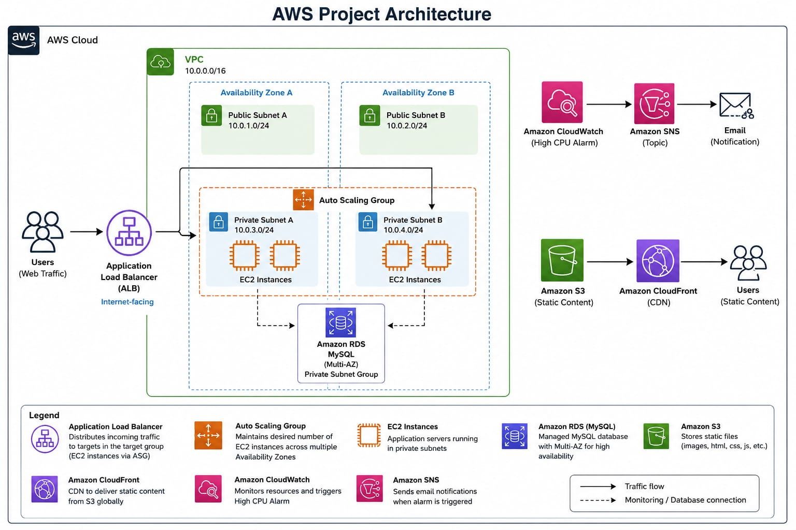
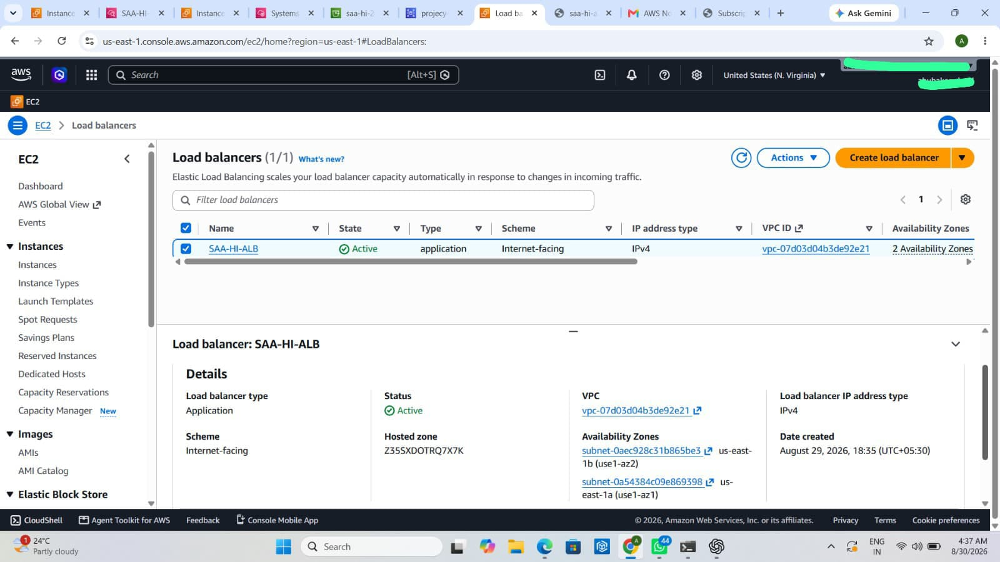
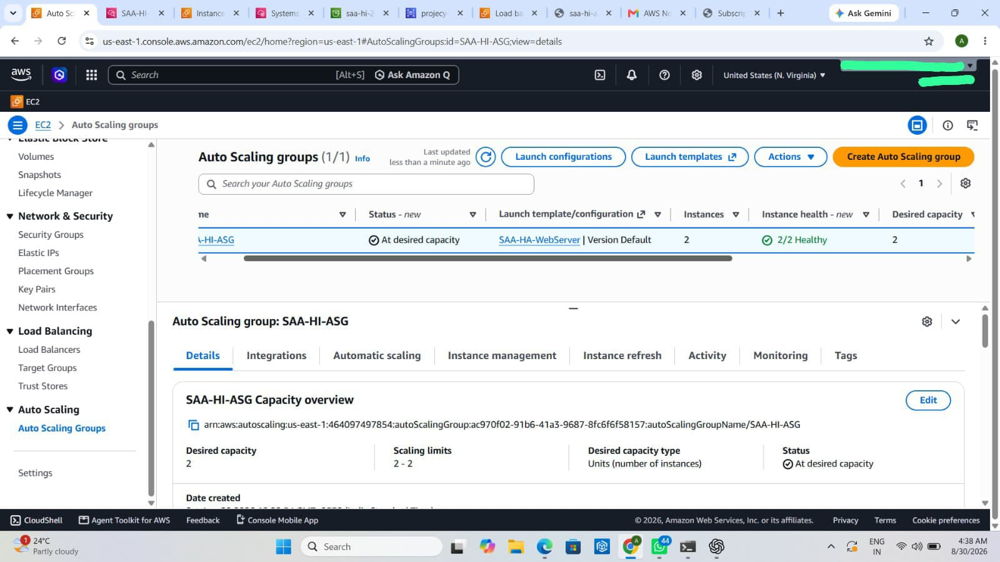
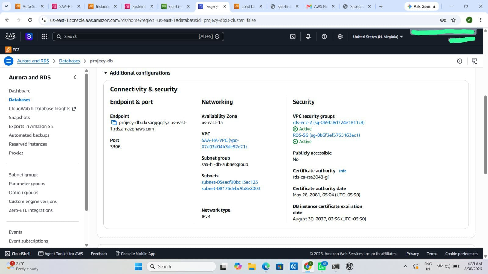
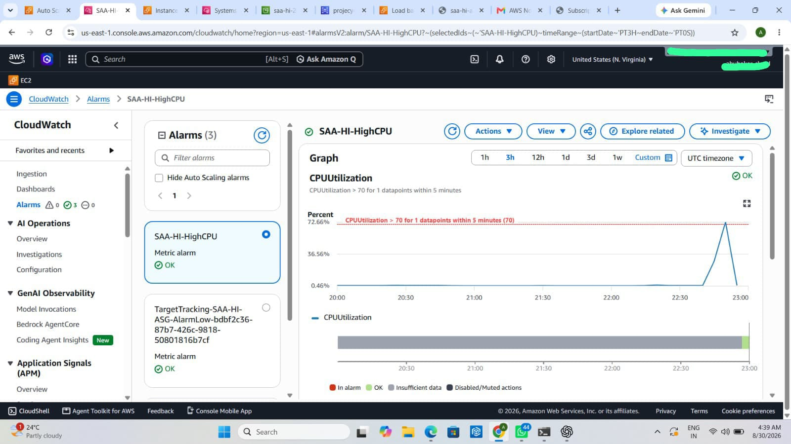
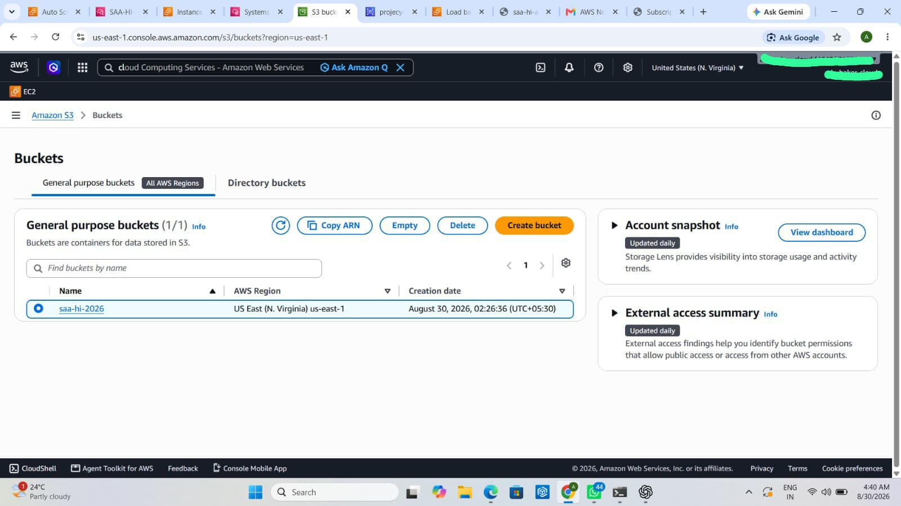
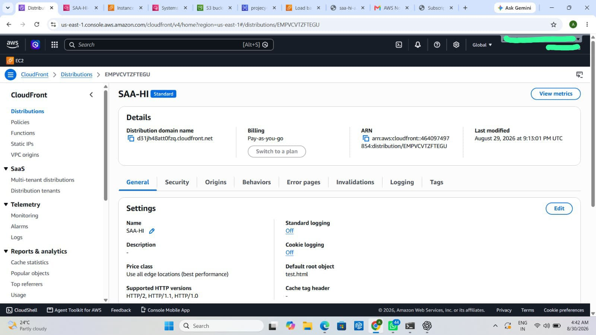

# AWS High Availability Web Application

## 📌 Project Overview

A hands-on AWS Cloud Architecture project focused on building a scalable and highly available web application.

The main goal was to understand how multiple AWS services integrate together to create a reliable cloud architecture.

## 🏗️ Architecture

User → Application Load Balancer → Target Group → EC2 Auto Scaling Group → RDS

S3 → CloudFront

EC2 → CloudWatch → Alarm → SNS → Email

## 🛠️ AWS Services Used

| AWS Service | Purpose |
|------------|---------|
| **Amazon VPC** | Created an isolated network environment with public and private subnets across multiple Availability Zones. |
| **Application Load Balancer (ALB)** | Distributes incoming HTTP traffic across multiple EC2 instances. |
| **EC2** | Hosts the web application servers inside private subnets. |
| **EC2 Auto Scaling** | Maintains multiple healthy EC2 instances and provides scalability and fault tolerance. |
| **Target Group** | Registers EC2 instances and performs health checks for the load balancer. |
| **Amazon RDS (MySQL)** | Provides a managed relational database for the application. |
| **Amazon S3** | Stores static website content and objects. |
| **Amazon CloudFront** | Delivers S3 content globally through AWS edge locations with lower latency. |
| **Amazon CloudWatch** | Monitors EC2 metrics such as CPU utilization. |
| **Amazon SNS** | Sends email notifications when CloudWatch alarms are triggered. |

## 🔄 Architecture Flow

### Web Application Traffic

User → Application Load Balancer → Target Group → EC2 Auto Scaling Group → RDS MySQL

### Static Content Delivery

S3 → CloudFront → Users

### Monitoring & Notifications

EC2 → CloudWatch → Alarm → SNS → Email

## 🔒 Security

- EC2 instances are deployed in private subnets and are accessed through the Application Load Balancer.
- RDS MySQL is not publicly accessible and is deployed within private subnets.
- Security Groups control traffic between the Load Balancer, application servers, and database layer.
- Network access is restricted to the required application communication paths.

## 🚀 High Availability & Scalability

- The application runs across multiple Availability Zones to improve fault tolerance.
- An Application Load Balancer distributes incoming traffic across healthy EC2 instances.
- EC2 Auto Scaling maintains the required number of application instances and supports horizontal scaling.
- Health checks help ensure that traffic is routed only to healthy application instances.
- Amazon RDS provides a managed database layer for the application.
## 🛠️ Challenges & Troubleshooting

During the implementation, I faced challenges related to:

- EC2 ↔ RDS connectivity
- Target Group Health Checks
- CloudWatch Alarm configuration

Troubleshooting these issues helped me develop a better understanding of AWS networking, traffic flow, service integration, and problem-solving.

## 📸 Implementation Evidence

### Application Load Balancer

### EC2 Auto Scaling

### Amazon RDS MySQL

### Amazon CloudWatch

### Amazon S3

### Amazon CloudFront

## 🎯 Key Learnings

- AWS Networking
- High Availability
- Scalability & Auto Scaling
- Load Balancing
- Database Connectivity
- Cloud Security
- Monitoring & Alerting
- AWS Service Integration

## 📚 Project Status

Completed — Project 1 of 3 AWS Cloud Architecture projects.
